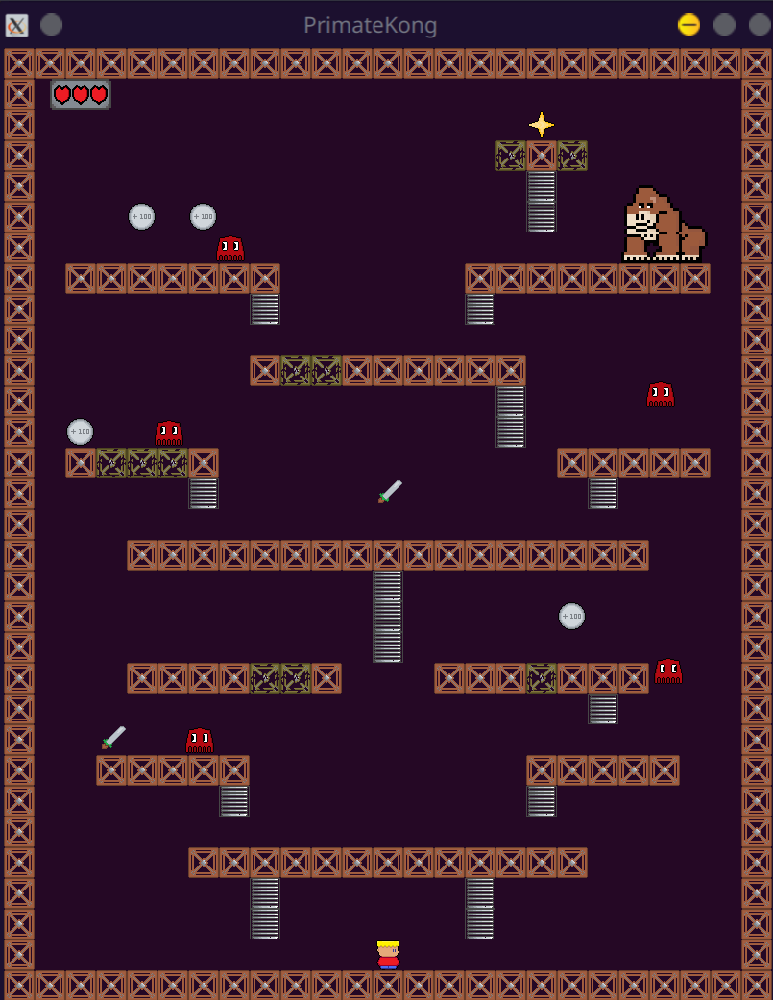

# PrimateKong

## Overview

Welcome to the Computer Science Labs I repository! This project is an exciting recreation of the classic Donkey Kong game, offering a nostalgic gaming experience.

### Instructions

- **Menu Navigation:**
  - Use the arrow keys (←, →, ↑, ↓) to navigate through menus.

- **Movement Controls:**
  - Utilize the following keys for in-game movement:
    - W: Move upward
    - A: Move leftward
    - S: Move downward
    - D: Move rightward

 - **Unlocking Secret Mode (PrimateKong+):**
   - Press the keys S, T, A, and R simultaneously on the main menu to access the hidden secret mode.

## Contributors

* Ricardo Morais

## Image Gallery

<div align="center">
  
  
  
  
  <!-- Add more images as needed -->
</div>

## Prerequisites

Before running this project, ensure that you have both Cabal and the Glasgow Haskell Compiler (GHC) installed on your machine. If you haven't installed them yet, you can conveniently download and install both using GHCup, which is available at: 

- GHCup : [GHCup Download](https://www.haskell.org/ghcup/)

Make sure to follow the instructions provided on the website to complete the installation correctly.

## Executable

You can compile and run the program using the build and run commands of cabal.

```bash
cabal run primate-kong
```

## Interpreter

You can open the Haskell interpreter (GHCi) using cabal with the project automatically loaded.

```bash
cabal repl
```

## Tests

The project uses the [HUnit](https://hackage.haskell.org/package/HUnit) library for unit testing.

You can run the tests using the following command

```bash
cabal test
```

If you want to run examples from the documentation as unit tests, use the [Doctest](https://hackage.haskell.org/package/doctest) library.

```bash
cabal repl --build-depends=QuickCheck,doctest --with-ghc=doctest
```

## Documentation

You can generate documentation using [Haddock](https://haskell-haddock.readthedocs.io/).

```bash
cabal haddock
```
