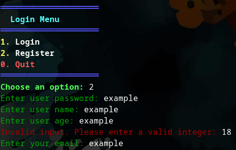
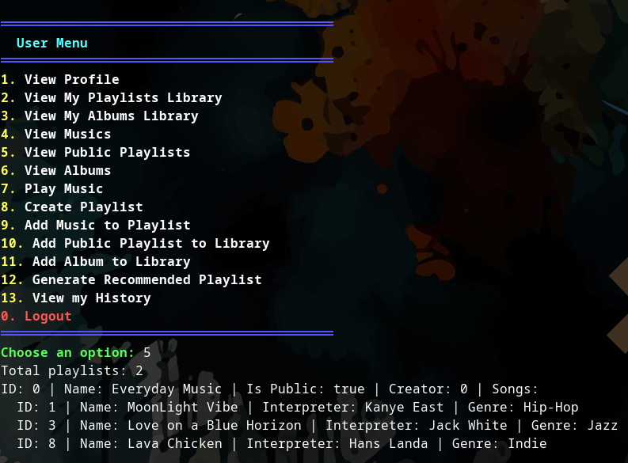
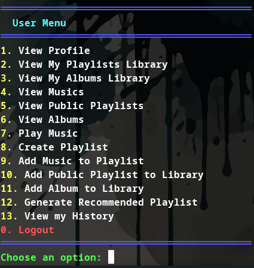

# SpotifUM

## Overview

**SpotifUM** is a music management application inspired by Spotify, developed as a project for an Object-Oriented Programming course. Built entirely in **Java**, the application simulates a music platform through a terminal-based interface. It supports user registration, login, music library management, playlists, and admin-level operations.

Although SpotifUM does **not actually play music**, it simulates playback and interactions by printing relevant information to the terminal.

## Contributors

* [PaoComPlanta](https://github.com/paocomplanta)
* [SirLordNelson](https://github.com/sirlordnelson)

## Features

- User registration and login system using ID and password  
- Administrator account (`ID: -1`, `Password: 1234`) with extended privileges  
- Music library management: add, view, and search for tracks  
- Albums and playlists (including auto-generated playlists based on user preferences)  
- Support for multiple music types (explicit, multimedia, etc.)  
- Subscription plans that unlock additional features  
- Simulated music playback (output to terminal only)  
- Persistent state: save and load the application's state  
- Javadoc documentation generation  
- Unit tests implemented using **JUnit**

> 💾 A sample saved state is available in the `save/` directory. It includes preloaded data such as test users and music entries, so you can explore the system immediately.

## Screenshots

Below are some screenshots of the **SpotifUM** app in action:

<div align="center">
  
  
  
</div>

## How to Run

Run the application using:

```bash
./gradlew run
```

## Documentation

Generate the Javadoc documentation using:

```bash
./gradlew javadoc
```

The generated documentation will be available in the `build/docs/javadoc/` directory.

## Testing

Run the unit tests with:

```bash
./gradlew test
```
