# 🛰️ Deep Space Communication System (CC-2526)

**Practical Assignment 2 - Computer Communications (2025/2026)**

A robust distributed simulation of space communications between a Mothership and planetary Rovers using custom TCP/UDP protocols.

---

## 📋 Table of Contents

- [Overview](#-overview)
- [Architecture](#-architecture)
  - [Components](#components)
- [Protocols Design](#-protocols-design)
  - [Communication Ports](#communication-ports)
  - [MissionLink (ML)](#missionlink-ml)
  - [TelemetryStream (TS)](#telemetrystream-ts)
- [Mission Types](#-mission-types)
- [Supported Planets](#-supported-planets)
- [Project Structure](#-project-structure)
- [Getting Started](#-getting-started)
  - [Prerequisites](#prerequisites)
  - [Installation](#installation)
- [Usage](#-usage)
  - [Command-Line Options](#-command-line-options)
- [Technical Details](#-technical-details)
- [Authors](#-authors)

---
## 🔭 Overview

This project simulates a mission control environment for space exploration. It is designed to operate within a simulated network topology (e.g., CORE emulator) where network reliability is not guaranteed. The system consists of three main components:

- **Mothership (Server)**: Orbits the planet, receiving telemetry and dispatching missions.
- **Rovers (Clients)**: Autonomous units on the ground that execute missions and stream data.
- **Ground Control (Observer)**: A visualization dashboard for mission status and real-time telemetry.

### Key Features

- 🚀 **Concurrency**: Heavy use of Go goroutines for handling multiple rovers simultaneously.
- 📦 **Custom Serialization**: Optimized binary serialization for low-bandwidth environments.
- 🛡️ **Fault Tolerance**: Automatic reconnection logic and error handling for TCP streams.
- 📊 **Real-time Monitoring**: Live updates of rover metrics (Health, Internal Temperature, Battery, Position).

---
## 🏗 Architecture

The system follows a distributed architecture:

```mermaid
graph LR
    GC[🎮 Ground Control] <-->|HTTP API| MS[🛸 Mothership]
    
    MS <-->|TelemetryStream<br/>TCP| R1[🤖 Rover 1]
    MS <-->|MissionLink<br/>UDP| R1
    
    MS <-->|TelemetryStream<br/>TCP| R2[🤖 Rover 2]
    MS <-->|MissionLink<br/>UDP| R2
```



### Components

- **Mothership** (`cmd/mothership`): Acts as the central TCP server. It listens for incoming telemetry connections from Rovers, provides missions upon request, and broadcasts mission parameters via UDP. It exposes an API for the Ground Control.

- **Rover** (`cmd/rover`): Simulates a physical unit. It generates telemetry data (randomized within realistic bounds), requests missions from the Mothership, and listens for mission packets. It handles logic for "survival" (battery/health management).

- **Ground Control** (`cmd/ground-control`): An interface that consumes data from the Mothership to visualize the state of the entire fleet.

---
## 📡 Protocols Design

To meet the specific requirements of space communication (high latency, potential packet loss), we implemented two distinct application-layer protocols.

### Communication Ports

The system uses the following port configuration:

- **TelemetryStream (TCP)**: Port `5001` - Continuous telemetry data transmission
- **MissionLink (UDP)**: Port `5000` - Mission requests and assignments
- **HTTP API**: Port `8080` - Ground Control communication with Mothership
- **Ground Control Web UI**: Port `8060` - Dashboard interface

### MissionLink (ML)

- **Transport**: UDP (User Datagram Protocol)
- **Purpose**: Bidirectional communication for mission requests and mission parameters between Mothership and Rovers
- **Rationale**: UDP provides low overhead. Since mission data is often time-sensitive or repetitive broadcast, the connectionless nature allows for quick dissemination without the handshake overhead of TCP. Rovers can request missions, and the Mothership can broadcast mission parameters
- **Packet Sizes**:
  - Mission Assignment: 512 bytes
  - Mission Progress: 256 bytes
  - Mission Request: 128 bytes
  - Acknowledgment: 32 bytes
- **Implementation**: Located in `internal/missionlink`

### TelemetryStream (TS)

- **Transport**: TCP (Transmission Control Protocol)
- **Purpose**: Continuous, reliable streaming of sensor data (Coordinates, Battery, Internal Temperature) from Rover to Mothership
- **Rationale**: Telemetry data is critical. Packet loss could result in missing vital status updates. TCP ensures ordered and error-checked delivery
- **Packet Size**: 64 bytes (fixed format for efficient bandwidth usage)
- **Update Interval**: 4 seconds per telemetry transmission
- **Resilience**: The implementation (`internal/rover/controller.go`) includes logic to detect broken pipes and attempt reconnections automatically (max 5 retries with 3-second delays)

---

## 🎯 Mission Types

The system supports five distinct mission types, each with specific objectives and configurations:

### 1. Global Mapping (`map_global`)
Systematic planetary surface mapping using different navigation strategies:
- **SPIRAL**: Outward spiral pattern from starting point
- **RANDOM**: Stochastic exploration of the area
- **EXHAUSTIVE_COVERAGE**: Complete grid-based coverage

### 2. Environmental Study (`estudo_ambient`)
Comprehensive environmental data collection including:
- Temperature, humidity, and atmospheric pressure monitoring
- Radiation level measurements
- Air quality analysis (atmospheric composition)
- Configurable capture intervals for continuous monitoring

### 3. Photographic Reconnaissance (`recon_foto`)
Visual documentation of the planetary surface:
- Configurable maximum image count
- Adjustable capture intervals
- Targeted point-of-interest photography

### 4. Technical Diagnostics (`diagn_tecnico`)
System health assessment and maintenance:
- Component-level diagnostics
- Performance validation
- Results: SUCCESS, FAIL, or UNCLEAR

### 5. Environmental Sampling (`amostra_ambient`)
Physical sample collection and analysis:
- **BIOLOGICAL**: Organic matter and life indicators
- **GEOLOGICAL**: Rock and mineral samples
- **FLUID**: Liquid or gas samples

---

## 🌍 Supported Planets

The simulation includes detailed planetary models with realistic physical parameters:

### Mars (Default)
- **Gravity**: 3.71 m/s²
- **Atmospheric Pressure**: 6.36 hPa
- **Temperature Range**: 186K - 293K (-87°C to 20°C)
- **Day Length**: 24h 39m 35s
- **Radiation**: 233 μSv/h (base level)

### Venus
- **Gravity**: 8.87 m/s²
- **Atmospheric Pressure**: 92,000 hPa (92 bar)
- **Temperature Range**: 230K - 737K (-43°C to 464°C)
- **Day Length**: 117 Earth days
- **Radiation**: 287 μSv/h (base level)

These parameters directly affect rover operations, power generation efficiency, and mission planning.

---
## 📂 Project Structure

```
.
├── bin/                 # Compiled binaries
├── cmd/                 # Entry points for applications
│   ├── ground-control/  # Visualization dashboard
│   ├── mothership/      # Central server logic
│   └── rover/           # Rover simulation logic
├── internal/            # Private application code
│   ├── api/             # REST API for Ground Control
│   ├── common/          # Shared types and helpers
│   ├── missionlink/     # UDP Protocol implementation
│   ├── network/         # Low-level network wrappers
│   ├── rover/           # Rover internal logic (physics/status)
│   ├── serialization/   # Custom binary data encoding
│   └── telemetrystream/ # TCP Protocol implementation
├── static/              # Assets for the UI (Fonts, CSS, Images)
├── Makefile             # Build automation
└── go.mod               # Go dependencies
```

---
## 🚀 Getting Started

### Prerequisites

- Go 1.22 or higher
- Make (optional, for using the Makefile)
- Linux/Unix environment (recommended for CORE emulation)

### Installation

1. **Clone the repository:**

   ```bash
   git clone <repository-url>
   cd CC-2526
   ```

2. **Download Static Assets:**

   This project requires specific fonts and icons for the Ground Control UI.

   ```bash
   chmod +x download_assets.sh
   ./download_assets.sh
   ```

3. **Build the Binaries:**

   Use the provided Makefile to compile all components.

   ```bash
   make
   ```

   This will generate executables in the `bin/` directory.

---
## 🕹 Usage

You can run the components individually in separate terminal windows.

### 1. Start the Mothership

The Mothership must be started first to listen for connections.

```bash
./bin/mothership
```

### 2. Start a Rover

You can start multiple rovers. Each rover requires a unique ID.

```bash
# Syntax: ./bin/rover [flags]
./bin/rover -id 1 -name "Curiosity" -planet mars -x 10 -y 10
```

### 3. Start Ground Control

Launch the dashboard to view the data.

```bash
./bin/ground-control
```

Access the dashboard at `http://localhost:8060` (default port).

---

## 🛠 Command-Line Options

### Mothership

```bash
./bin/mothership [OPTIONS]
```

**Options:**
- `-name string` - Mothership identifier name (default: "Alpha")

**Example:**
```bash
./bin/mothership -name "Discovery"
```

### Rover

```bash
./bin/rover [OPTIONS]
```

**Options:**
- `-id uint` - Unique rover identifier (default: 1)
- `-name string` - Rover display name (default: "Explorer")
- `-planet string` - Target planet: "mars" or "venus" (default: "mars")
- `-x int` - Starting X coordinate (default: 0)
- `-y int` - Starting Y coordinate (default: 0)
- `-ip string` - Mothership IP address (default: "localhost")

**Examples:**
```bash
# Basic usage
./bin/rover -id 1 -name "Curiosity" -planet "mars"

# Multiple rovers on different coordinates
./bin/rover -id 1 -name "Curiosity" -x 100 -y 200 -ip "10.0.0.1"
./bin/rover -id 2 -name "Perseverance" -x -50 -y 150 -ip "10.0.0.1"

# Venus exploration
./bin/rover -id 3 -name "Venera" -planet "venus" -ip "10.0.0.1"
```

### Ground Control

```bash
./bin/ground-control [OPTIONS]
```

**Options:**
- `-port string` - Web UI listening port (default: ":8060")
- `-mothership string` - Mothership IP address (default: "127.0.0.1")
- `-local string` - Local IP for display purposes (default: "localhost")

**Examples:**
```bash
# Basic usage
./bin/ground-control

# Custom configuration for network topology
./bin/ground-control -port ":8061" -mothership "10.0.0.1" -local "10.0.0.10"
```

---

## 🔬 Technical Details

### Custom Binary Serialization

The project implements highly optimized binary serialization for all network packets:

- **Fixed-size packets** eliminate parsing overhead
- **Network byte order** ensures cross-platform compatibility
- **Zero-copy operations** where possible for performance
- **Type-safe encoding/decoding** prevents data corruption

**Telemetry Packet Structure (64 bytes):**
```
[0]     RoverId (1 byte)
[1-11]  Name (11 bytes, fixed length)
[12]    Status (1 byte)
[13-16] Position.X (4 bytes)
[17-20] Position.Y (4 bytes)
[21-22] Position.Z (2 bytes)
[23]    Battery (1 byte)
[24-27] InternalTemp (4 bytes)
[28-31] ExternalTemp (4 bytes)
[32]    Humidity (1 byte)
[33-36] Pressure (4 bytes)
[37-40] Radiation (4 bytes)
[41-48] Timestamp (8 bytes)
[49-52] Velocity (4 bytes)
[53-54] Direction (2 bytes)
[55-62] Uptime (8 bytes)
[63]    SystemHealth (1 byte)
```

### Time Simulation

The system includes an accelerated time simulation:
- **Time Factor**: 1 real second = 1200 simulated seconds (20 minutes)
- Allows for rapid mission testing and demonstration
- Synchronized across all system components

### Mission States

Missions progress through the following states:
- **PLANEADA** - Initial planning phase
- **EM_PROGRESSO** - Active execution
- **CONCLUIDA** - Successfully completed
- **FALHADA** - Mission failure
- **CANCELADA** - Manually cancelled

### Fault Tolerance

The system implements several fault tolerance mechanisms:
- **Automatic TCP reconnection** with exponential backoff (max 5 retries, 3s delay)
- **UDP best-effort delivery** with mission request retries (every 16 seconds)
- **State synchronization** between Ground Control and Mothership
- **Graceful degradation** when network issues occur

### Building & Development

The project includes a comprehensive Makefile with the following targets:

#### Build Commands

```bash
make          # Build all components (rover, mothership, ground-control)
make rover    # Build only the rover binary
make mothership   # Build only the mothership binary
make ground-control  # Build only the ground control binary
make clean    # Remove all compiled binaries
```

#### Documentation Generation

The project supports multiple documentation formats:

**Markdown Documentation** (requires `gomarkdoc`):
```bash
make markdoc       # Generate markdown documentation for all packages
make markdocclean  # Remove generated documentation
```

To install `gomarkdoc`:
```bash
go install github.com/princjef/gomarkdoc/cmd/gomarkdoc@latest
```

**Interactive Documentation Server** (requires `pkgsite`):
```bash
make doc           # Start local documentation server at http://localhost:8080
```

To install `pkgsite`:
```bash
go install golang.org/x/pkgsite/cmd/pkgsite@latest
```

After running `make doc`, open your browser at `http://localhost:8080/cc.2526` to explore the full Go package documentation with an interface similar to pkg.go.dev.

#### Runtime Requirements

**For Running the Binaries:**
- No external dependencies required after compilation
- All components are statically linked Go binaries
- Supported platforms: Linux, macOS, Windows (with WSL recommended)

**For Ground Control UI:**
- Static assets must be downloaded first (`./download_assets.sh`)
- Required fonts: Inter, JetBrains Mono
- Required icons: Font Awesome 6.4.0
- Modern web browser with JavaScript enabled

**Network Requirements:**
- Open ports: 5000 (UDP), 5001 (TCP), 8060 (HTTP), 8080 (HTTP API)
- For distributed setups: IP connectivity between components
- For CORE emulator: Network topology properly configured

**Optional Development Tools:**
```bash
# Code formatting
go fmt ./...

# Run tests (if available)
go test ./...

# Static analysis
go vet ./...
```

---
## 👥 Authors

**Group 4 - PL5**

- DelgadoDevT - [GitHub](https://github.com/DelgadoDevT)
- SirLordNelson - [GitHub](https://github.com/SirLordNelson)
- PaoComPlanta - [GitHub](https://github.com/PaoComPlanta)

*Universidade do Minho, 2025*
